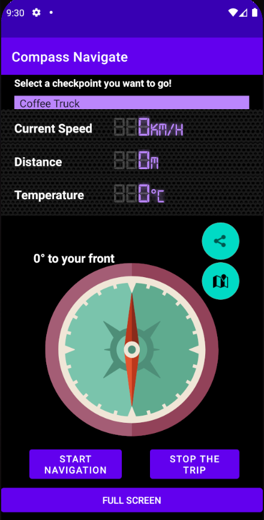

# Compass app in Android

:watch: ​Mobile GIS & LBS asn1 + asn2

## Description

A new start-up company asks you to develop a location-based fitness app based on Android.
The fitness app aims at encouraging the users to get out of their home and do a round trip
running or walking near their home.

### Assignment 1

:point_right: The app should read a list of possible checkpoints from the file system

:point_right: After starting the app, a user can select one checkpoint from a drop-down that they want to go to

:point_right: A basic compass screen shows the direction and distance to the checkpoint’s position
(like on a radar)

- Compass directs to the position of checkpoint

:point_right: ​Show the current speed of the user and the temperature

:point_right: ​When the user reaches the checkpoint, the app should notify the user with either text or audio. 

:point_right: ​To make the trip a complete round trip, the compass should then point towards the starting location again.

:point_right: ​Once the user completed the round trip (i.e., arrive the starting location), the app should again notify the user, provide a reward, and save the data to a CSV file. 

### Assignment 2

:point_right: **Social sharing option:** users can share their latest record as a simple text. 

 - Users can share by click the share button in the main activity.
 - When users click back button to quit the app, a dialog will pop up to ask for sharing.

:point_right: **Track upload:** When a trip is finished, a dialog pops up to ask for uploading records to ArcGIS server. Users can click `SHARE` to view the trajectory and checkpoint, and upload the records.

:point_right: **Track review:**  Users can view all tracks by clicking the map button in the main activity. 

- Users can select from the spinner to show records of a certain user
- Users can tap a trajectory to look through the attributes of the trajectory.

## UI

## Requirements

Android Studio 3.4.1 

API level min. 19

